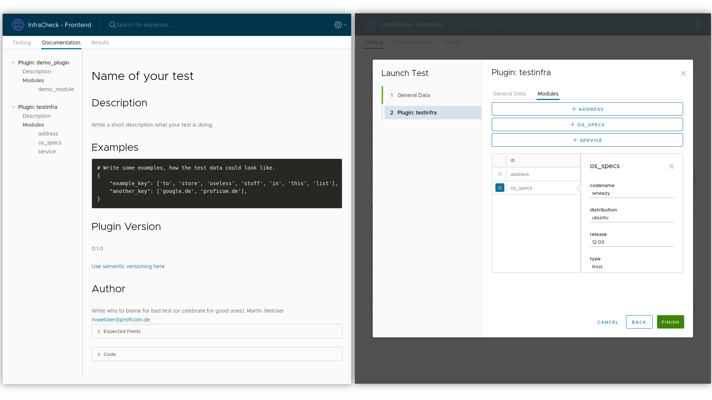

# InfraCheck 
> This tool delivers you a universal codeless test server. Send simple ``json`` files to **InfraCheck** and start complex test flows.
> Custom _plugins_ and _modules_ extend the functionality of this tool. 
>
> If you need to perform complicated test operations, write them once, as a _plugin_ or _module_ and share them with everybody.
> 
> This tool grows, as you do.
>
> **Note**: You don't like ``json``? \
> \--> This app ships with web interface, that lets you define your tests using forms.
>> Version: 0.1.0

## Build Status
|  Branch  | Status |
| -------- | ------ |
| master   |  TODO  |

## Motivation
- Are your tired of programming your test code? 
- Would you like to test your infrastructure more often? 
- Is testing so far more of a chore?

Did you answer any of these questions with **yes**? Then **InfraCheck** could help you.

Being based on a plugin architecture, this

## Description
### Features
* ★ Codeless testing - No need to write complicated code
* 🌷 Plugin system - Share your modules and benefit from the work of others
* ⏰ Fast and superior - Define complex test sets within minutes using existing plugins
* 🍕 Sharing of results - Share your results the way you like:
    - JSON
    - HTML
    - PDF
* 🌴 Automate everything - Using the **InfraCheck** API you can easily automate your tests
* 🌐 You don't like JSON, or use this tool the first time? 
    - Try out our fancy web interface




### Links
- 👉 [Demo Application TODO]()
- 🌟 The Company behind: [Profi.com AG](https://www.proficom.de/)
- 📘 Developer documentation: [Docs]()

### Built With
#### Frontend
* [Angular](https://angular.io/) - Frontend framework
* [Yarn](https://yarnpkg.com/) - Dependency Management
* [Clarity Design System](https://clarity.design/) - HTML/CSS framework + Angular components by vmware

#### Backend
* [Python 3]() - backend language
* [Flask 1.1.x](https://pypi.org/project/Flask/) - WSGI framework
* [Waitress](https://pypi.org/project/waitress/) - WSGI server for production ([Why flask is not production ready?](https://flask.palletsprojects.com/en/1.1.x/tutorial/deploy/#run-with-a-production-server))
* [SQLite]() - Database
* Plugins:
    - Infracheck ([infracheck](https://pypi.org/project/infracheck/))

#### Deployment
* [Docker](https://www.docker.com/) - Container system
* [Docker-Compose](https://docs.docker.com/compose/) - Multi Container management

## Requirements
### Docker
**Perquisites**

* Docker ([Installation](https://docs.docker.com/get-docker/))
* Docker-Compose ([Installation](https://docs.docker.com/compose/install/))

## Setup
### Production
#### Using Docker
I recommend deploying this application with ``docker`` and ``docker-compose``.
```shell script
# Clone this repository first
cd diploma-os-testing
docker-compose up -d    # Build and launch the containers
```
#### Offline Setup
If your target system does not have access to the internet, to download Python packages during runtime, you can follow the [offline tutorial](docs/OFFLINE_GUIDE.md).

### Develop
This guide is for developers who want to contribute to this application.

#### Frontend
Make sure you have ``Node``, ``NPM`` and ``Yarn`` installed for the frontend.
```shell script
cd ./frontend
yarn install  # Install dependencies
yarn start    # Serve the application under 
```
Now the frontend should be reachable on http://localhost:4200.

#### Backend
For the backend you simply need to install ``Python 3`` and package manager ``pip``. 

For development, you should run the server using ``Flask WSGI``, to receive all logs.
This is not recommended for production.
```shell script
# Create and Checkout virtual environment
cd ./backend
pip install virtualenv              # Install virtualenv
python3 -m venv venv_infracheck     # Create virtual environment
source venv_infracheck/bin/activate # Activate venv

# Install Requirements
pip install -r requirements.txt

# [Windows] set environment variables
set FLASK_APP=infracheck            
set FLASK_ENV=development

# [Linux] set environment variables
export FLASK_APP=infracheck
export FLASK_ENV=development

# Launch the backend in `debug` mode
flask run --host='0.0.0.0' --port=5000 --debugger
```
The backend should now be reachable on http://localhost:5000/plugins.

### Configuration
The application can be configured using environment variables. The following parameters can be configured:

| Service  | Variable | Description                                                                                                                                                                                                                                                                                        |
|----------|----------|----------------------------------------------------------------------------------------------------------------------------------------------------------------------------------------------------------------------------------------------------------------------------------------------------|
| Frontend | SECURE   | Should be 'true' if the backend has SECURE='true' as well. It is used to activate 'nuxt auth' properply. (default: True in 'production' and False in 'development')                                                                                                                                |
| Backend  | SECURE   | Secures the whole API. A login at /login is necessary before using the application. Authentication is enabled using JWT tokens.  The token is generated after a successful /login request, and should be used with any further request. (default: True in 'production' and False in 'development') |
| Backend  | PASSWORD | The password that is required for a successful login. (Default:'password')                                                                                                                                                                                                                         | 

## Testing
You can launch tests for the backend with:
```
cd backend
python -m unittest discover test "*Test.py"
```

## Documentation
The API is fully documented with swagger. You can access that by opening `<BACKENDSERVER>` in your browser.
FOr the frontend, there is no detailed documentation currently.

## Known Issues
Things that we want to add later:

## Versioning
We use [SemVer](http://semver.org/) for versioning. For the more information see [Versioning](https://git.lab.proficom.de/lab/scrummaster/src/branch/master/docs/VERSIONING.md).

## Contribute
Please feel free to open [Bugs, Feature Requests](https://git.lab.proficom.de/lab/scrummaster/issues) or [Pull Requests](https://git.lab.proficom.de/lab/scrummaster/pulls).

## License
This work is licensed under “profi.com AG business soulutions".

## Contact
If you have trouble or need help running InfraCheck, please contact us:
- Mail [pclabadmin@proficom.de](mailto:pclabadmin@proficom.de)

## Authors
- **Martin Welcker** - *Architect and Developer* - [Mail](mailto:mwelcker@proficom.de)
- **Mike Junghanns** - *Product Owner* - [Mail](mailto:mjunghanns@proficom.de)
- **Daniel Schier** - *Product Owner* - [Mail](mailto:dschier@proficom.de)


